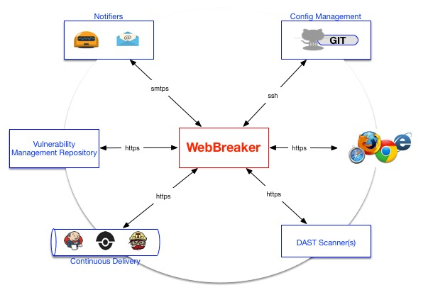

### Introduction ###
Build functional security testing, into your software development and release cycles! WebBreaker provides the capabilities to automate and centrally manage Dynamic Application Security Testing (DAST) as part of your DevOps pipeline.

WebBreaker truly enables all members of the Software Security Development Life-Cycle (SDLC), with access to security testing, greater test coverage with increased visibility by providing Dynamic Application Security Test Orchestration (DASTO).  Current support is limited to the World's most popular commercial DAST product, WebInspect.

### System Architecture ###


### Supported Features ###
* Command-line (CLI) scan administration of WebInspect with Foritfy SSC products.
* [Jenkins Continuous Deployment](https://jenkins.io) support
* Docker container support
* Email alerting or notification.
* Extensible event logging with scan administration and results.
* [WebInspect REST API](https://pypi.python.org/pypi/webinspectapi) support for v9.30 and later.
* [Fortify Software Security Center (SSC) REST API](https://pypi.python.org/pypi/fortifyapi) support for v16.10 and later.
* WebInspect scan cluster support between two (2) or greater WebInspect servers/sensors.
* Capabilities for extensible scan telemetry with ELK and Splunk.
* GIT support for centrally managing [WebInspect scan configurations](https://github.com/automationdomination/Webinspect).
* Python compatibility with versions 2.x or 3.x

### Quick Local Installation ###
Install WebBreaker from github.com.
* ```git clone https://github.com/target/webbreaker```
* ```export PATH=$PATH:$PYTHONPATH```
* ```python setup.py install```

**NOTE:**

* As with any Python application [pip](https://pip.pypa.io/en/stable/installing) is required for install and execution.
* Include your site-packages, if they are not declared ```export PATH=$PATH:$PYTHONPATH```.
* WebBreaker is compatible with Jenkins Global Environmental variables or other custom parameterized strings in Jenkins can be passed, for example --scan_name=${BUILD_TAG}.

### Usage ###
WebBreaker is a command-line interface (CLI) client.  See our complete [_WebBreaker Documentation_](https://target.github.io/webbreaker/) for further configuration, usage, and installation.

The CLI supports upper-level and lower-level commands with respective options to enable interaction with Dynamic Application Security Test (DAST) products.  Currently, the two Products supported are WebInspect and Fortfiy (more to come in the future!!)

Below is a Cheatsheet of supported commands to get you started.  

---


    List all scans:
    webbreaker webinspect list --server webinspect-1.example.com:8083
    
    Query scans:
    webbreaker webinspect list --server webinspect-1.example.com:8083 --scan_name important_site
    
    List with http:
    webbreaker webinspect list --server webinspect-1.example.com:8083 --protocol http

    Download WebInspect Scan:
    webbreaker webinspect download --server webinspect-2.example.com:8083 --scan_name important_site_auth
    
    Download WebInspect Scan as XML:
    webbreaker webinspect download --server webinspect-2.example.com:8083 --scan_name important_site_auth -x xml
    
    Download WebInspect Scan with http:
    webbreaker webinspect download --server webinspect-2.example.com:8083 --scan_name important_site_auth --protocol http
    
    Basic WebInspect Scan:
    webbreaker webinspect scan --settings important_site_auth
    
    Advanced WebInspect Scan with overrides:
    webbreaker webinspect scan --settings important_site_auth --allowed_hosts example.com --allowed_hosts m.example.com` |
    
    Scan with local WebInspect settings:
    webbreaker webinspect scan --settings /Users/Matt/Documents/important_site_auth.xml
    
    Initial Fortify SSC Initial Listing with Authentication:
    webbreaker fortify list --fortify_user $FORTIFY_SSC_USER --fortify_password $FORTIFY_SSC_PASS
    
    Interactive Listing of All Fortify SSC Application/Versions:
    webbreaker fortify list
    
    List Fortify SSC Versions of an Application:
    webbreaker fortify list --application webinspect
    
    Upload with passed auth:
    webbreaker fortify upload --fortify_user $FORT_USER --fortify_password $FORT_PASS --version important_site_auth
    
    Upload with username/password prompts:
    webbreaker fortify upload --version important_site_auth
    
    Upload with application override:
    webbreaker fortify upload --application my_other_app --version important_site_auth
    
    Upload with scan_name overrides:
    webbreaker fortify upload --version important_site_auth --scan_name auth_scan

----

### WebBreaker Console Output ###

```
webbreaker webinspect scan --settings MyCustomWebinspectSetting --scan_policy Application --scan_name some_scan_name
 _       __     __    ____                  __            
| |     / /__  / /_  / __ )________  ____ _/ /_____  _____
| | /| / / _ \/ __ \/ __  / ___/ _ \/ __ `/ //_/ _ \/ ___/
| |/ |/ /  __/ /_/ / /_/ / /  /  __/ /_/ / ,< /  __/ /    
|__/|__/\___/_.___/_____/_/   \___/\__,_/_/|_|\___/_/     

Version 1.2.0

JIT Scheduler has selected endpoint https://some.webinspect.server.com:8083.
WebInspect scan launched on https://some.webinspect.server.com:8083 your scan id: ec72be39-a8fa-46b2-ba79-10adb52f8adb !!

Scan results file is available: some_scan_name.fpr
Scan has finished.
Webbreaker complete.
```

### Bugs and Feature Requests

Found something that doesn't seem right or have a feature request? [Please open a new issue](https://github.com/target/webbreaker/issues/new/).

### Copyright and License

* Copyright 2017 Target Brands, Inc.
* [Licensed under MIT](LICENSE.txt).
